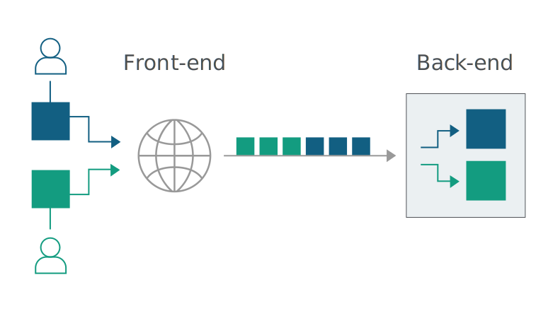

## HTTP Request Smuggling

### Overview
- Interfering with the way a site processes sequences of HTTP requests received from one or more users
- Usually allows bypassing security controls, gaining of unauthorized access, compromising other users 
- Primarily associated with HTTP/1 requests; however, some HTTP/2 vulnerable depending on backend architecture
- Today's web apps usually employ chains of HTTP servers between users and the ultimate logic: users send requests to the frontend server (sometimes called a load balancer or reverse proxy) and this server forwards the request(s) to one or more backend servers. 
- Typically, when the frontend server forwards HTTP requests to the backend server, it sends several requests over the same connection for efficiency and performance. HTTP requests are sent one after another, and the receiving server has to determine where one request ends and the next one begins: 



- An attacker can try and trick the backend server. For example, an attacker might send an ambiguous request that gets interpreted differently by the frontend and the backend systems. In this example, the attacker causes part of their frontend request to be interpreted by the backend server as the start of the next request. It is effectively prepended to the next request and can interfere with the way the application processes that request:


### How Does This Happen?

- HTTP/1 specification provides two different ways to specify where a request ends:
    1. `Content-Length` header: Pretty straightforward. Specifies the length of the message body in bytes. 
    2. `Transfer-Encoding` header

```
POST /search HTTP/1.1
Host: normal-website.com
Content-Type: application/x-www-form-urlencoded
Content-Length: 11

q=smuggling
```

```
POST /search HTTP/1.1
Host: normal-website.com
Content-Type: application/x-www-form-urlencoded
Transfer-Encoding: chunked

b
q=smuggling
0
```